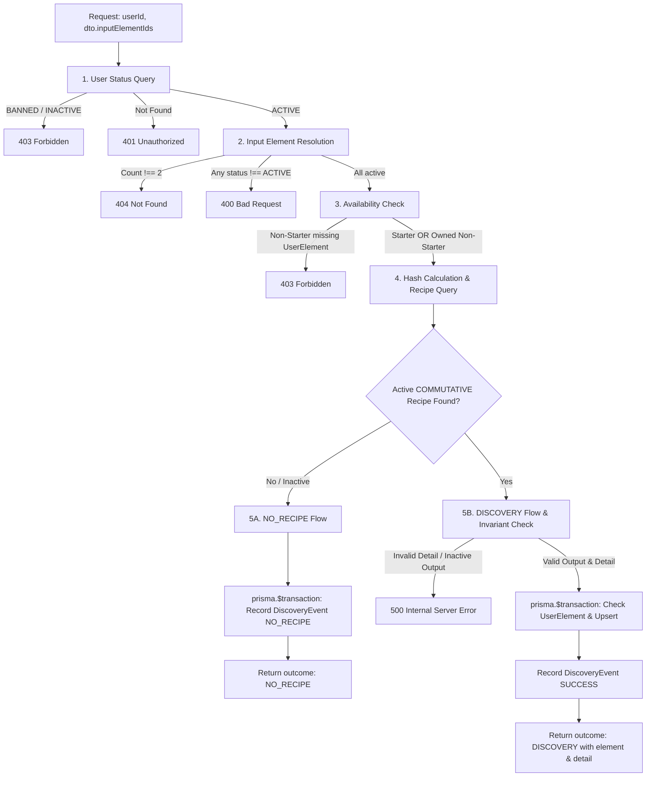

# FROZEN_CRAFT_SERVICE_IMPLEMENTATION_PLAN_V1

## Goal & Scope

This document specifies the implementation plan for **CraftService V1** in **FinCraft Lab** to back the frozen `POST /craft` contract.

Crafting is the core discovery mechanism of FinCraft Lab. Authenticated users combine two financial Elements (e.g. `income` + `expense`) to produce a new Discovery Element or receive a `NO_RECIPE` outcome.

This planning task is documentation-only. No application source code, NestJS modules, controllers, services, DTOs, schema migrations, or database modifications are performed in this task.

---

## Actual Schema & Code Contracts Analysis

Analysis of relevant models from `prisma/schema.prisma`:

| Model | Primary/Unique Constraints | Relevant Fields & Types | Role in CraftService |
|---|---|---|---|
| **User** | `@id id` (UUID), `@unique email` | `status` (`UserStatus`: `ACTIVE`, `INACTIVE`, `BANNED`) | User account active state verification |
| **Element** | `@id id` (UUID), `@unique slug` | `isStarter` (Boolean), `status` (`ContentStatus`: `ACTIVE`, etc.), `name`, `emoji`, `elementType` | Input existence, status, starter check & Output payload mapping |
| **DiscoveryDetail** | `@id id` (UUID), `@unique elementId` | `shortDescription`, `realLesson`, `example`, `possibleBenefit`, `possibleTradeoff`, `hiddenRisk`, `worksWhen`, `becomesDifficultWhen`, `whatChangesOutcome`, `realityLevel`, `safetyLabel`, `sources` (Json) | Output discovery detail payload mapping & runtime source parsing |
| **CraftRecipe** | `@id id` (UUID), `@unique inputHash` | `outputElementId` (UUID), `ruleType` (`CraftRuleType`), `status` (`ContentStatus`) | Recipe lookup by input hash & active state check |
| **UserElement** | `@id id` (UUID), `@@unique([userId, elementId])` | `userId` (UUID), `elementId` (UUID), `unlockedAt` (DateTime) | Non-starter input ownership check & output unlock state (`isNewDiscovery`) |
| **DiscoveryEvent** | `@id id` (UUID), `@@index([userId, discoveredAt])` | `userId` (UUID), `recipeId` (UUID?), `resultElementId` (UUID?), `inputElementIds` (Json), `resultStatus` (`DiscoveryResultStatus`), `discoveredAt` (DateTime) | Audit log for every valid craft attempt (`SUCCESS` / `NO_RECIPE`) |

---

## Service Boundaries & Method Signature

`CraftService` will be an `@Injectable()` service residing in `src/craft/craft.service.ts`.

### Public Method Signature

```typescript
export class CraftService {
  constructor(private readonly prisma: PrismaService) {}

  async craft(
    userId: string,
    dto: CraftRequestDto,
  ): Promise<CraftResult>
}
```

- **Input Parameters**:
  - `userId`: `string` (Verified user UUID extracted via `@CurrentUser()` decorator from JWT payload).
  - `dto`: `CraftRequestDto` (Validated DTO containing `inputElementIds` array of 2 distinct UUID v4 strings).
- **Return Type**: `Promise<CraftResult>` (Explicit discriminated union type from `src/craft/types/craft-response.type.ts`).

---

## Step-by-Step Execution Architecture



---

## Technical Decisions (Frozen)

### 1. User Status Policy
- `AuthGuard` verifies JWT signature and payload claims but does not query PostgreSQL.
- `CraftService` queries `User` status during request execution:
  - If `User` row does not exist: Throws `UnauthorizedException('User account not found')` (401).
  - If `user.status === UserStatus.INACTIVE` or `UserStatus.BANNED`: Throws `ForbiddenException('User account is disabled')` (403).

### 2. Input Element Resolution & Availability Policy
- **Resolution**:
  - Query `Element` table where `id` in `dto.inputElementIds`.
  - If returned elements count !== 2: Throws `NotFoundException('Element not found')` (404).
  - If any element has `status !== ContentStatus.ACTIVE`: Throws `BadRequestException('Input element is not active')` (400).
- **Availability**:
  - Filter input elements for non-Starters (`isStarter === false`).
  - If non-Starter elements exist, query `UserElement` where `userId === userId` AND `elementId` in `nonStarterElementIds`.
  - If returned `UserElement` count !== nonStarterElementIds.length: Throws `ForbiddenException('Input element is not unlocked by user')` (403).

### 3. Hash Calculation & Recipe Lookup
- Calls pure shared helper `calculateCraftInputHash(dto.inputElementIds[0], dto.inputElementIds[1])`.
- Returns `{ canonicalElementIds: [string, string], inputHash: string }`.
- Queries `CraftRecipe` by `@unique inputHash` with relation `outputElement` including `discoveryDetail`.
- A valid recipe requires:
  - `recipe !== null`
  - `recipe.ruleType === CraftRuleType.COMMUTATIVE`
  - `recipe.status === ContentStatus.ACTIVE`

### 4. Output & Discovery Detail Invariants
- For a matching recipe, `CraftService` verifies:
  - `outputElement !== null` AND `outputElement.status === ContentStatus.ACTIVE`
  - `outputElement.isStarter === false` (Under Core Recipe V1, all craft outputs are Discovery elements)
  - `outputElement.discoveryDetail !== null`
  - `discoveryDetail.sources` parses successfully via `parseCraftSources()`.
- If any output invariant fails: Throws `InternalServerErrorException('Invalid output element or discovery detail configuration')` (500). No `UserElement` or `DiscoveryEvent` is created.

### 5. Runtime Sources Parser
- Pure helper function `parseCraftSources(rawSources: unknown): CraftSourceResponse[]` located in `src/craft/parsers/craft-sources.parser.ts`.
- Validates:
  - `rawSources` is an Array.
  - Each item is a non-null Object with string properties `title`, `organization`, `url`.
  - Rejects missing fields, non-string types, or malformed structures by throwing an Error (which gets caught and mapped to 500 Internal Server Error).

### 6. Transaction Boundary & Outcome Logging
All DB writes run inside `prisma.$transaction(async (tx) => ...)`:

#### A. NO_RECIPE Outcome:
- Create `DiscoveryEvent`:
  - `userId`: `userId`
  - `recipeId`: `null`
  - `resultElementId`: `null`
  - `inputElementIds`: `canonicalElementIds` (canonical sorted string array)
  - `resultStatus`: `DiscoveryResultStatus.NO_RECIPE`
  - `discoveredAt`: `new Date()`
- Return `{ outcome: 'NO_RECIPE' }`.

#### B. DISCOVERY Outcome:
- Check existing `UserElement` for `(userId, outputElement.id)`.
- If `UserElement` exists:
  - `isNewDiscovery = false`
- If `UserElement` does not exist:
  - Create `UserElement` (`userId`, `elementId: outputElement.id`, `unlockedAt: new Date()`).
  - `isNewDiscovery = true`
- Create `DiscoveryEvent`:
  - `userId`: `userId`
  - `recipeId`: `recipe.id`
  - `resultElementId`: `recipe.outputElementId`
  - `inputElementIds`: `canonicalElementIds`
  - `resultStatus`: `DiscoveryResultStatus.SUCCESS`
  - `discoveredAt`: `new Date()`
- Return mapped `CraftDiscoveryResult`.

### 7. Concurrency Strategy (`@@unique([userId, elementId])`)
- Problem: Two concurrent craft requests for the same output element race to create `UserElement`.
- Strategy:
  1. `CraftService` checks for existing `UserElement` inside `$transaction`.
  2. If not found, attempts `tx.userElement.create(...)`.
  3. If a concurrent request creates the `UserElement` simultaneously, `tx.userElement.create` triggers Prisma `P2002` (Unique constraint failed).
  4. In PostgreSQL / Prisma interactive transactions, a `P2002` failure aborts the transaction block (`25P02`).
  5. `CraftService.craft()` catches `P2002` on the outer `$transaction` call, recognizes a concurrency race on `UserElement`, and performs **1 service-level retry** of the `$transaction`.
  6. On retry, the pre-check finds the `UserElement` row inserted by the winning request, sets `isNewDiscovery = false`, and successfully records the second `DiscoveryEvent` without surfacing a 500 error to the client.

---

## Planned Implementation Files

| File Path | Target Physical Lines | Purpose / Responsibility |
|---|---|---|
| `src/craft/craft.service.ts` | ~200 - 250 lines | Core business logic, status checks, recipe lookup, transaction management |
| `src/craft/parsers/craft-sources.parser.ts` | ~30 - 45 lines | Pure runtime validator for `DiscoveryDetail.sources` Json |
| `src/craft/mappers/craft-response.mapper.ts` | ~40 - 60 lines | Pure DTO transformation mapping Prisma entities to `CraftResult` |

---

## Error Mapping Matrix

| Cause / Scenario | Exception Class | HTTP Code | Public Message Envelope |
|---|---|---|---|
| Malformed DTO / Non-UUID | `BadRequestException` | 400 | Class-validator standard response |
| Duplicate input IDs | `BadRequestException` | 400 | `"inputElementIds must contain unique values"` |
| Input Element `status !== ACTIVE` | `BadRequestException` | 400 | `"Input element is not active"` |
| JWT token missing / invalid | `UnauthorizedException` | 401 | `"Invalid or missing authentication token"` |
| User account missing in DB | `UnauthorizedException` | 401 | `"User account not found"` |
| User `status === INACTIVE / BANNED` | `ForbiddenException` | 403 | `"User account is disabled"` |
| Non-Starter input not unlocked | `ForbiddenException` | 403 | `"Input element is not unlocked by user"` |
| Input Element ID not found | `NotFoundException` | 404 | `"Element not found"` |
| Valid pair, no active recipe | None | 200 | `{ "data": { "outcome": "NO_RECIPE" } }` |
| Valid pair, active recipe | None | 200 | `{ "data": { "outcome": "DISCOVERY", "isNewDiscovery": boolean, ... } }` |
| Corrupt Detail / DB Failure | `InternalServerErrorException` | 500 | `"Internal server error"` |

---

## 20-Scenario Acceptance Matrix

| # | Test Scenario | Inputs | User State | Expected Result | UserElement Effect | DiscoveryEvent Effect | Verification Scope |
|---|---|---|---|---|---|---|---|
| 1 | New Discovery | 2 unlocked inputs, valid recipe | ACTIVE | 200 `DISCOVERY` (`isNewDiscovery: true`) | +1 row | +1 row (`SUCCESS`) | Service + E2E |
| 2 | Rediscovery | 2 unlocked inputs, owned output | ACTIVE | 200 `DISCOVERY` (`isNewDiscovery: false`) | Unchanged | +1 row (`SUCCESS`) | Service + E2E |
| 3 | Reverse Input Order | Inputs `[B, A]` | ACTIVE | 200 `DISCOVERY` (same result as `[A, B]`) | Same as `[A, B]` | +1 row (`SUCCESS`) | Service + E2E |
| 4 | Valid Pair, No Recipe | 2 unlocked inputs, no recipe | ACTIVE | 200 `NO_RECIPE` | Unchanged | +1 row (`NO_RECIPE`) | Service + E2E |
| 5 | Unknown Input ID | 1 fake UUID | ACTIVE | 404 Not Found | Unchanged | None | Service + E2E |
| 6 | Inactive Input Element | 1 `INACTIVE` element | ACTIVE | 400 Bad Request | Unchanged | None | Service + E2E |
| 7 | Non-Starter Unavailable | User lacks `UserElement` | ACTIVE | 403 Forbidden | Unchanged | None | Service + E2E |
| 8 | INACTIVE User Account | 2 valid inputs | INACTIVE | 403 Forbidden | Unchanged | None | Service + E2E |
| 9 | BANNED User Account | 2 valid inputs | BANNED | 403 Forbidden | Unchanged | None | Service + E2E |
| 10 | Inactive Craft Recipe | Recipe `status: INACTIVE` | ACTIVE | 200 `NO_RECIPE` | Unchanged | +1 row (`NO_RECIPE`) | Service + E2E |
| 11 | Inactive Output Element | Output `status: INACTIVE` | ACTIVE | 500 Internal Error | Rolled back | Rolled back | Service |
| 12 | Starter Output Invariant | Output `isStarter: true` | ACTIVE | 500 Internal Error | Rolled back | Rolled back | Service |
| 13 | Missing DiscoveryDetail | Detail `null` | ACTIVE | 500 Internal Error | Rolled back | Rolled back | Service |
| 14 | Malformed Detail Sources | `sources` invalid JSON | ACTIVE | 500 Internal Error | Rolled back | Rolled back | Service |
| 15 | Event Creation Failure | DB error on event log | ACTIVE | 500 Internal Error | Rolled back | Rolled back | Service |
| 16 | UserElement Creation Fail | DB error on unlock | ACTIVE | 500 Internal Error | Rolled back | Rolled back | Service |
| 17 | Concurrent Discovery Race | Concurrent requests | ACTIVE | Both 200 OK (1 true, 1 false) | Exactly +1 row | +2 rows (`SUCCESS`) | Service + E2E |
| 18 | Existing UserElement Race | Pre-existing `UserElement` | ACTIVE | 200 OK (`isNewDiscovery: false`) | Unchanged | +1 row (`SUCCESS`) | Service |
| 19 | Hash Helper Call Path | Valid inputs | ACTIVE | Hash verified via helper call | Standard | Standard | Service |
| 20 | Response Field Leak Prev. | Any valid request | ACTIVE | No internal IDs/hashes exposed | Standard | Standard | Service + E2E |

---

## Verification Plan

### Non-Mutating Verification
1. Type Checking: `corepack pnpm@11.15.1 exec tsc --noEmit -p tsconfig.json`
2. Linting: `corepack pnpm@11.15.1 run lint`
3. Git Status & Diff Check:
   - `git status --short`
   - `git diff --stat`

Expected altered files:
- `docs/ai/plans/CRAFT_SERVICE_IMPLEMENTATION_PLAN.md`
- `docs/ai/CURRENT_STATUS.md`
- `docs/ai/FILE_MAP.md`
